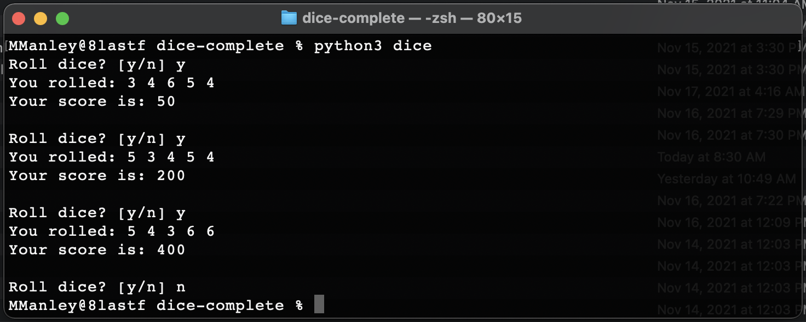

# CSE210-03 | Programming with Classes | Articulate

## Overview
---
Dice is a game in which the player seeks to earn as many points as possible by repeatedly rolling five dice and accumulating the score until they are no longer able to continue.

## Rules
---
Dice is played according to the following rules.

   - The game is played with five dice.
   - The player is asked, "Roll dice?" at the beginning of each turn.
   - If the player answers "n" or no, the game is over.
   - If the player answers "y" or yes, the points are added to their score.
   - The player scores 100 points for each one that is rolled.
   - The player scores 50 points for each five that is rolled.
   - The dice values and player score are displayed on the screen.
   - If the player does not roll any ones or fives the game is over.

## Interface
---

## Requirements
---
The program must also meet the following requirements.

   - The program must include a README file.
   - The program must include class and method comments.
   - The program must have at least two classes.
   - The program must remain true to game play described in the overview.

## Have Some Fun
---
Have some fun by enhancing the game any way you like. A few ideas are as follows.

   - Enhanced input validation.
   - Enhanced game play and game over messages.
   - Enhanced game display, e.g. different dice
